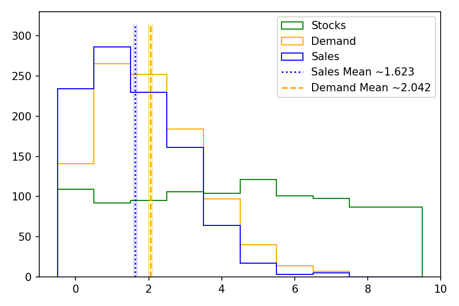
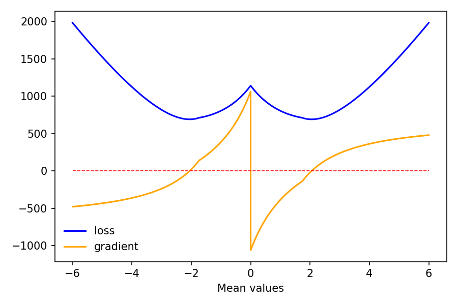
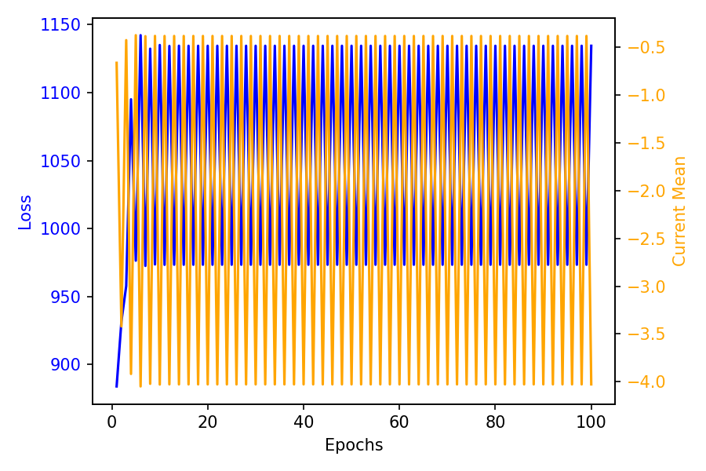
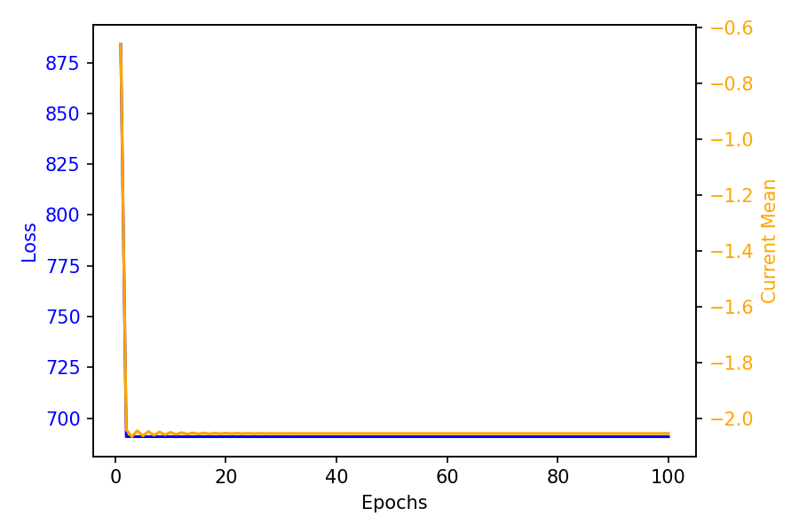
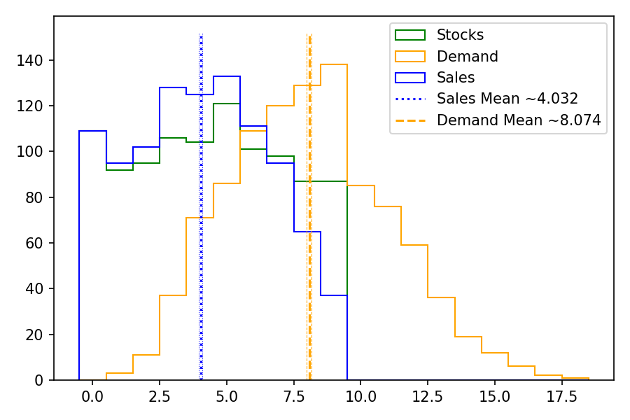
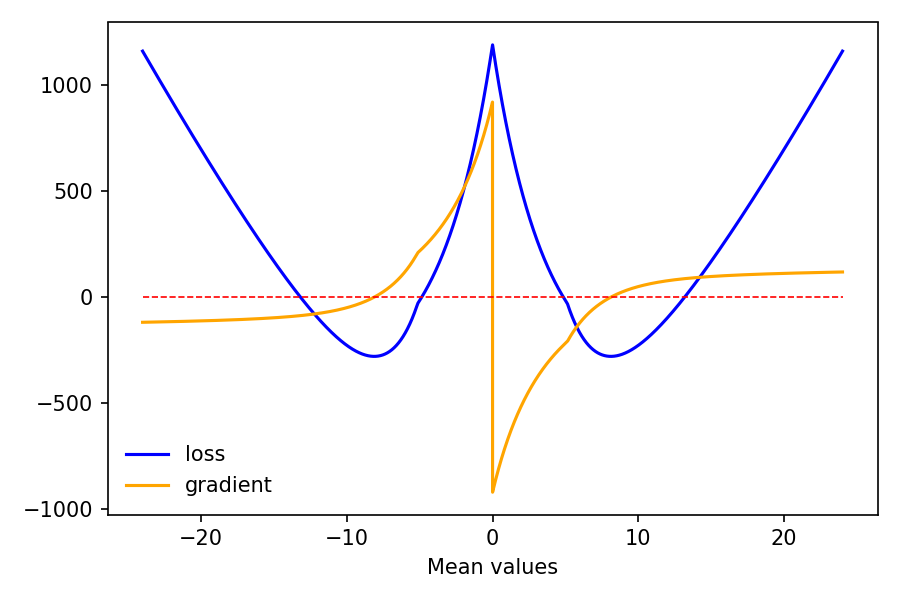
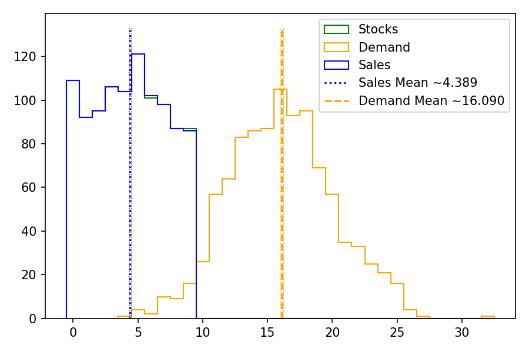
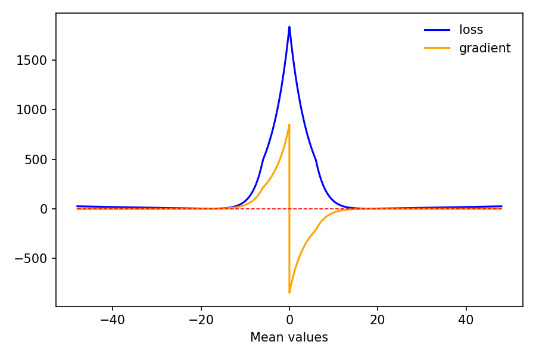

# Data Science Exercise: Loss for Demand Predictions of an Online Store

This repo contains my solution to the Blue Yonder exercise for data scientists.

## Ansatz

As basis to my loss-function definition, I used the publication
["Sales Data and the Estimation of Demand" by S. A. Conrad (1976)](https://link.springer.com/article/10.1057/jors.1976.13).
This text provides a likelihood function definition for the newspaper-vendor problem
assuming poisson distributed demand and a fixed stock level:
$$ L(m) = \frac{n!}{r_0! r_1! \dots{} r_{N-1}!} \left[ \prod_{j=0}^{N-1} \left( \frac{m^j e{}^{-m}}{j!}\right)^{r_j} \right] \left(\sum_{x-N}^{\infty{}} \frac{m^x e{}^{-m}}{x!} \right)^{n-r}$$

See the paper for all details on the exact definition of the occurring variables.

The last term of this likelihood definition describes the distribution of the data points for which the vendor ran out of stock.
From this basis I derive a likelihood $\mathcal{L}$ for the more general case of varying stock levels
and take the negative logarithm of the thus obtained likelihood arriving at:

$$ -log(\mathcal{L}(m)) = \text{Const.} -\sum_{S_j \forall{} j | S_j < C_j}^{} \left( m - S_j \log(m) \right)  - \sum_{S_j \forall{} j | S_j = C_j}^{} \log \left( 1 - P_{\text{CDF}}(m; S_j - 1) \right)$$

and the derivative thereof:

$$ \frac{d}{dm} -log(\mathcal{L}(m)) = -\sum_{S_j \forall{} j | S_j < C_j}^{} \left(1 - \frac{S_j}{m} \right)  - \sum_{S_j \forall{} j | S_j = C_j}^{} \frac{ P_{\text{CDF}}(m; S_j - 1) - P_{\text{CDF}}(m; S_j - 2)}{1 - P_{\text{CDF}}(m; S_j - 1)}$$

where $P_{\text{CDF}}$ is the cumulative distribution function of the poisson distribution.
$m$ is the poisson rate (mean prediction).
$S_j$ and $C_j$ are the elements of the sales and stock tensors, respectively.

The first term of the negative log-likelihood is constant and can be ignored.
The derivative of the negative log-likelihood is not necessary for the numerical evaluation of the problem;
it only served as additional tool to evaluate the behaviour of the described negative log-likelihood as loss function.

Again, the last term covers the out-of-stock case,
and thus the sum in this case only goes over the sales data entries for which the sales are equal to the stock level.

The first sum only goes over sales entries where the current stock level was not reached.

The mean value $m$ for which this negative log-likelihood reaches its minimum
should be a good estimate for the true poisson rate of the underlying demand distribution.
This mean value $m$ that maximises the likelihood can be found by minimizing the negative log-likelihood
using the gradient decent approach provided in the code snippet.
For this approach, the negative log-likelihood is used directly as loss function.

# Implementation Details

The provided `MeanModel` allows for negative values of the mean predictions.
To allow for negative values in the above introduced loss function (negative log-likelihood),
negative mean prediction values are handled by taking the absolute value of the provided mean value in the loss function.
This leads to a loss function symmetric in the mean predictions around zero.
Furthermore, mean prediction values close to zero most be avoided,
due to the pole fore $m=0$ in the negative log-likelihood definition.
This is achieved by adding a ReLU term to the mean values
for mean values below the theoretical lower bound to $m$
as defined by [S. A. Conrad (1976)](https://link.springer.com/article/10.1057/jors.1976.13).
Hence, the input mean prediction values to the loss function are modified according to
```python
torch.abs(mean_input) + 0.5 * torch.nn.functional.relu(lower_bound_on_mean - torch.abs(mean_input))
```
where `lower_bound_on_mean` is the theoretical lower bound to the mean value.

Due to taking the absolute value of the mean prediction,
this loss definition will randomly lead to negative or positive results for the optimal mean parameter.
I simply take the absolute value of the resulting best fit mean value, knowing the loss function is symmetric.
One could also add a term to the loss function to penalize negative mean prediction values to avoid negative means.

## Results

### Default Case poisson rate = 2.0
I first evaluate the above defined loss function for the default case provided in the code snippet using:
* true poisson rate = 2.0
* stock min, max = (0, 10)
* sample size n = 1000
* leaning rate = 0.01

This poisson rate and stock level definition leads to the following distributions:



The simple mean of the observed sales underestimates the true demand.

The above defined loss function for this default case shows the described symmetry,
as well as two clear minima which seem to be located at the expected true mean values of `~2.0`:



The region where the ReLU contribution to the mean inputs affects the loss function
(and its gradient) are visible, as well, leading to well-defined functions for mean prediction inputs around 0.0.

Applying the `MeanModel` in combination with the stochastic gradient descent optimization
to find the minima of this loss, however, does not lead to convergence with the default learning rate of `0.01`.
The resulting best fit mean value is `4.027`.

For this case, the model does not converge, because the learning rate is too large.
The SGD algorithm oscillates between two values, which is visible in the loss curve:



To obtain satisfying results, the learning rate is changed to `0.005`,
leading to a mean demand prediction value of `2.054`.
The loss curve converges quickly to a satisfying value:



Further studies are conducted, using a true demand mean value of `1.0`,
for which the model converges when using a learning rate of `0.001`.

For larger true demand mean values,
the combination of loss function and model predicts the true demand mean well,
achieving good results with the default learning rate starting for true demand mean values above `~3.5`:

| True m | Predicted m | Learning Rate | max Epochs |
|-------:|:-----------:|:--------------|:-----------|
|    1.0 |    1.013    | 0.001         | 100        |
|    2.0 |    2.054    | 0.005         | 100        |
|    2.5 |    2.464    | 0.005         | 100        |
|    3.0 |    3.026    | 0.005         | 100        |
|    3.5 |    3.498    | 0.01          | 100        |
|    4.0 |    4.011    | 0.01          | 100        |
|    8.0 |    8.115    | 0.01          | 100        |
|   10.0 |   10.164    | 0.01          | 100        |
|   12.0 |   12.106    | 0.01          | 100        |
|   16.0 |   15.772    | 0.01          | 100        |
|   20.0 |   16.097    | 0.01          | 100        |
|   20.0 |   20.175    | 0.01          | 1000       |

For these cases, the loss converges quickly and yields a good estimate for the true demand mean.

The following figures shows the sales and demand distribution for the case of a true demand of 8.0,
where the stock levels capped at a maximum stock level of 9 (default value)
leads to strong divergence to the true demand mean when considering only the mean of the observed sales:





Despite the strong censoring of the true demand due to the available stock levels,
the loss function allows for a good estimate of the true demand mean.

For higher true demand mean values above `~16.0`,
the loss function starts to underestimate the true mean demand.
For such cases, the censoring of the true demand distribution due to limited stocks
leads to a sales distribution which is almost identical to the distribution of the stocks.
The demand is clearly larger than the available stock levels.
The obtained estimate for the mean demand provides a conservative target for stock levels
that should be kept by the online store.



However, for such extreme values, the above defined loss function becomes increasingly flat around its minima:



To achieve convergence for larger true mean demand values, the number of training epochs has to be increased.
For the case of a true mean demand of `20`, convergence is not achieved within 100 epochs (default value).
However, increasing the number of epochs to 1000,
the described approach again leads to a good estimate of `20.175` for the demand,
despite the increasingly flat distribution of the loss function.

## Running the Code

The code that is used for the described study can be executed by running:
```shell
python3 ./src/by_data_science_exercise/loss_study.py
```

or simply by running the command
```shell
by-data-science-exercise
```

if the package is installed as described below.


## Unit Tests

I implemented a test case for the `torch` variant of the poisson CDF,
which is necessary for the defined loss function.
The test compares the results of the `scipy` implementation of the poisson CDF to my `torch` variant
and covers edge cases, which caused `NaN` values, if not treated correctly in the `torch` implementation.

This test can be run with:
```shell
pytest
```

## UV

For this project I used `uv` as python package and project manager.

`uv` can be installed with the command
```shell
curl -LsSf https://astral.sh/uv/install.sh | sh
```

Read the script, e.g. with
```shell
curl -LsSf https://astral.sh/uv/install.sh | less
```
before running it!


`uv` can then be used to set up the project (after cloning it) with
```shell
git clone git@github.com:FelixMetzner/by_data_science_exercise.git
uv sync
```

We use `python` version `3.12`, since PyTorch is not supported under `python` version `3.13`, yet.

Source the python virtual environment with the usual command:
```shell
source ./.venv/bin/activate
```
